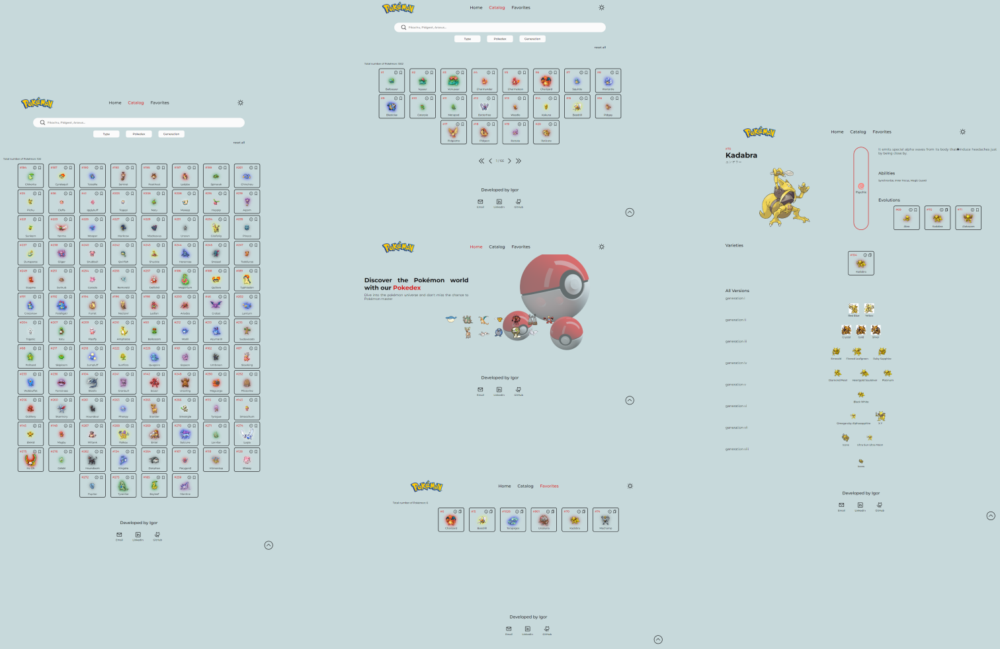

# Pokedex

The Pokedex is a tool for searching and exploring information about Pokémon. With it, you can discover details about each Pokémon, such as abilities, types, stats, and much more. It is ideal for Pokémon fans who want to learn more about their favorite characters.

## Layout preview

## TECHNOLOGIES

-   TypeScript
-   React.js
-   Styled-components
-   React Router Dom
-   Axios
-   React Query
-   React Hook Form
-   Yup

## User features

-   `Responsiveness`: interface adjusts to different screen sizes, ensuring a good experience on both mobile devices and desktops.
-   `Page Structure`: easy navigation between sections with support for scroll-to-top functionality.
-   `Theme Toggle`: switch between light and dark modes to match your preference.
-   `Advanced Search`: search for Pokémon by name and refine with filters by type, Pokédex number, and generation.
-   `Favorites`: save Pokémon for quick access with local storage.
-   `Pokémon Details`: view comprehensive information including number, name, image, types, description, abilities, evolutions, varieties, and versions.

## Deploy

Access the [Live Demo](https://igorchaves-pokedex.vercel.app/) or copy the URL directly: `https://igorchaves-pokedex.vercel.app/`
